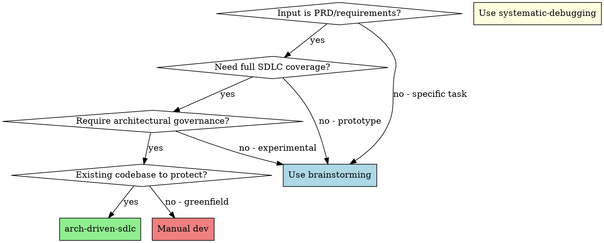
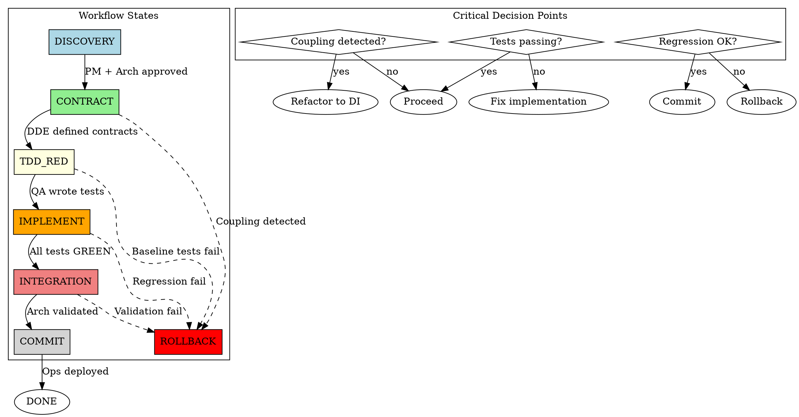
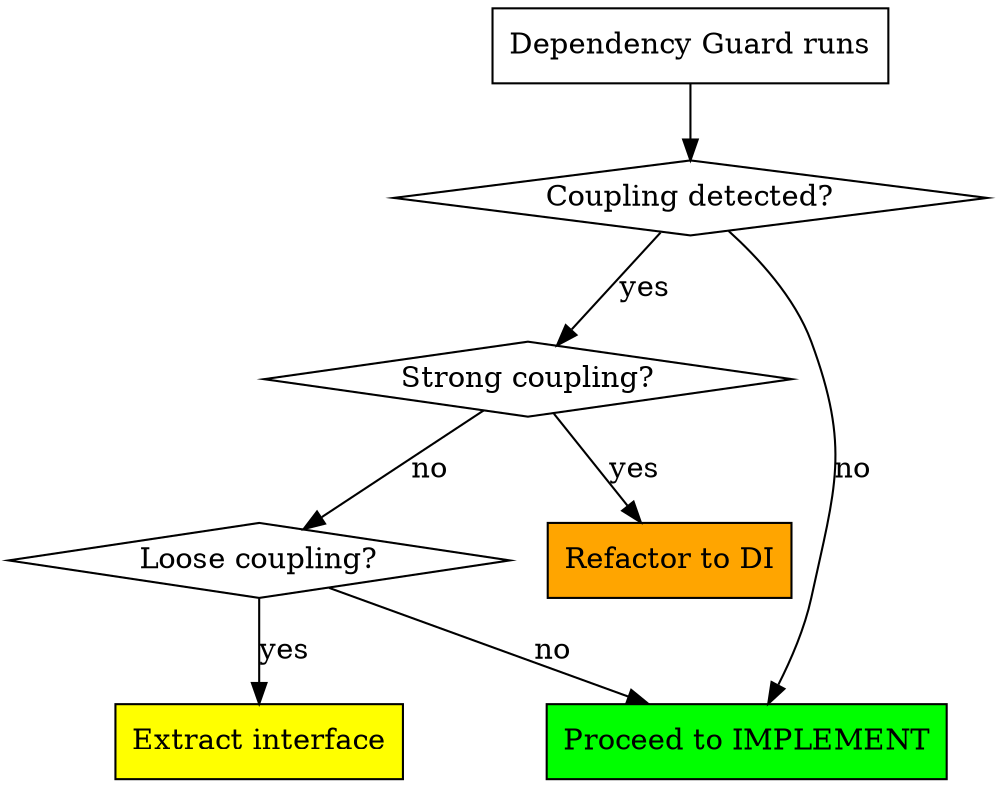
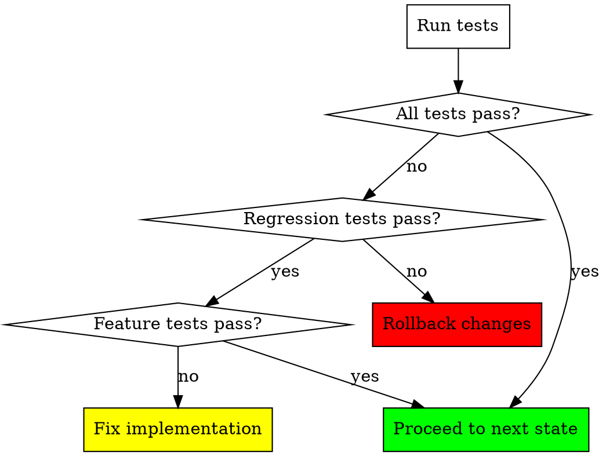

# Arch-Driven SDLC

Architecture-driven Software Development Life Cycle following Momo AI Engineering Protocol v3.0.

## Core Philosophy

**Inversion of Control (IoC):** Container instantiates Sub-Agents with controlled dependency chains.

**AOP Layer:** Cross-cutting concerns enforced through aspect interception:
- Dependency Guard (Before): AST scanning for coupling detection
- Anti-Regression (Around): Continuous regression testing with rollback on failure
- No-Silent-Failure: Structured logging enforcement

**Full-Stack Isolation Strategy:** Zero in-place editing. All changes must go through:
- Backend: Hexagonal Architecture (Ports and Adapters)
- Frontend: Shadow Components (Component.v2.tsx) + CSS Modules
- Database: Schema Evolution (add-only migrations)

## When to Use



**Triggers:**
- Building new features from requirements
- Existing codebase that needs protection from regression
- Requires architectural review before implementation
- Full test coverage requirement (unit + regression)

**Do NOT use when:**
- Quick bug fixes in isolated code (use systematic-debugging)
- One-off prototypes without existing code to protect (use brainstorming)
- Greenfield projects (no isolation needed yet)

## Configuration Requirements

This skill is a **framework-level design**. During actual execution, the following configuration is required to enable real LLM calls, AST scanning, and testing.

### Required Configuration

When invoking this skill, provide the following configuration:

```json
{
  "llm": {
    "provider": "openai" | "anthropic" | "ollama",
    "apiKey": "your-api-key-here",
    "endpoint": "https://api.openai.com/v1",  // Optional: custom endpoint
    "models": {
      "PM": "sonnet",
      "Arch": "opus",
      "DDE": "sonnet",
      "QA": "sonnet",
      "Dev": "haiku",
      "Ops": "sonnet"
    }
  },

  "ast": {
    "library": "tree-sitter",
    "languageGrammars": ["typescript", "javascript"],
    "couplingRules": "./rules/coupling-rules.json"
  },

  "testing": {
    "framework": "vitest",
    "testCommand": "npm test",
    "regressionPaths": ["tests/regression/**/*.test.ts"]
  },

  "git": {
    "enabled": true,
    "workingDirectory": "./",
    "mainBranch": "main"
  },

  "output": {
    "directory": "./output",
    "format": "markdown"
  }
}
```

### Configuration Fields Explained

| Field | Description | Required? |
|-------|-------------|-----------|
| **llm.provider** | LLM provider (openai, anthropic, ollama) | ✅ Yes |
| **llm.apiKey** | API key for the provider | ✅ Yes |
| **llm.models** | Agent to model mapping | ✅ Yes |
| **ast.library** | AST parsing library (tree-sitter) | ⚠️ Required for Dependency Guard |
| **testing.framework** | Test framework to use | ⚠️ Required for Anti-Regression |
| **testing.regressionPaths** | Paths to regression tests | ⚠️ Required for Anti-Regression |
| **git.enabled** | Whether to use git operations | ⚠️ Required for rollback |
| **output.directory** | Where to generate artifacts | ❌ No (defaults to ./output) |

### How to Provide Configuration

**Option 1: Environment Variables** (Recommended)
```bash
export ARCH_DRIVEN_LLM_PROVIDER="openai"
export ARCH_DRIVEN_LLM_API_KEY="sk-xxx"
```

**Option 2: Configuration File**
```bash
# Create config.json in project root
echo '{"llm": {...}, "testing": {...}}' > config.json
```

**Option 3: Inline During Invocation**
```markdown
I'm using arch-driven-sdlc with the following configuration:
- LLM: OpenAI GPT-4 (sonnet)
- Testing: Vitest with regression tests in tests/regression/
- Output: ./output
```

### Execution Flow

1. **Load Configuration** - Read from env var, file, or inline
2. **Initialize Container** - Create agents with configured models
3. **Execute Workflow** - Run through DISCOVERY → COMMIT states
4. **Apply Aspects** - Enable Dependency Guard, Anti-Regression, No-Silent-Failure
5. **Generate Artifacts** - Write outputs to configured directory

## Execution Pipeline



### Decision Flowcharts

#### Coupling Detection Decision



#### Test Failure Decision



### State Descriptions

| State | Agent(s) | Output | Transition Condition |
|-------|----------|--------|---------------------|
| **DISCOVERY** | PM, Arch | PRD + Impact Analysis | Architecture approved, no coupling |
| **CONTRACT** | DDE | OpenAPI + Schema Types | Contract defined |
| **TDD_RED** | QA | Failing tests (baseline) | Tests written and confirmed failing |
| **IMPLEMENT** | Dev, QA | Green tests + code | All tests passing, no regression |
| **INTEGRATION** | Arch, QA | Adapter injection + regression | Integration verified |
| **COMMIT** | Ops | Deployed artifact | Deployment successful |
| **ROLLBACK** | - | Revert changes | Any state fails validation |

## Quick Reference

### Sub-Agent Dispatch

```markdown
Use Agent tool with subagent_type="general-purpose" and prompt from:
- ./agents/pm-prompt.md       - Requirements analysis
- ./agents/arch-prompt.md     - Architecture + impact analysis
- ./agents/dde-prompt.md      - Schema + OpenAPI contract
- ./agents/qa-prompt.md       - TDD_RED + regression tests
- ./agents/dev-prompt.md      - Sandbox implementation
- ./agents/ops-prompt.md      - CI/CD configuration
```

### AOP Checks

| Aspect | When | Action | On Failure |
|--------|------|--------|------------|
| Dependency Guard | Before IMPLEMENT | Run AST scan, detect coupling | Block → Refactor to DI |
| Anti-Regression | Around IMPLEMENT | Run B module tests, rollback on fail | Block → Rollback |
| No-Silent-Failure | Throughout | Enforce structured logging | Block → Add logs |

### Isolation Rules

```
Backend:
  src/features/<feature-name>/
    domain/          # Hexagonal core
    ports/           # Interfaces
    adapters/        # Implementations

Frontend:
  components/<name>.v2.tsx    # Shadow components
  <name>.module.css            # Scoped styles

Database:
  migrations/YYYYMMDD_add_<table>.sql  # Add-only
```

## Rationalization Table

**Violating the letter of these rules is violating the spirit of these rules.**

| Excuse | Reality | Action |
|---------|---------|--------|
| "This is a simple feature, doesn't need full SDLC" | Simple features still need isolation and testing. Regression happens in "simple" code too. | Follow full workflow. |
| "I can edit the existing file, it's a small change" | Small changes cause big regressions. Violates Isolation Sandbox. | Create v2 component or new feature module. |
| "Coupling is acceptable here, the code is tightly bound" | Accepting coupling creates technical debt. Dependency Guard exists for a reason. | Refactor to DI, or escalate to human. |
| "I'll write tests after implementation" | Tests passing immediately proves nothing. TDD_RED ensures you're testing the right thing. | Write tests first. Delete if written before. |
| "This migration is just a column rename, MODIFY is fine" | Schema Evolution is add-only. Use ADD + migration script. | Create add-only migration with data migration script. |
| "Global CSS is faster, modules are overkill" | CSS Regression spreads to entire app. Recovery is impossible. | Use CSS Modules. |
| "The logs are clear, I don't need structured logging" | Production debugging requires context. Silent failures hide bugs. | Add structured logging with context. |
| "I'm just prototyping, quality doesn't matter" | Prototypes become production. Technical debt accumulates. | Follow isolation rules even for prototypes. |
| "The agent before me already validated, I can skip checks" | Each layer has different validation scope. Anti-Regression protects B modules, not A. | Run all AOP checks for your layer. |
| "I'll fix it in the next commit" | Deferred fixes become permanent bugs. | Fix before proceeding. |
| "This violates the letter but follows the spirit" | Spirit without letter is an excuse. | Follow both. |
| "I understand the intent, I don't need to read the full skill" | "Understanding" often means "I think I know it." Context evolves. | Read the full skill. |
| "This is a judgment call" | If it's a judgment call, document it and ask human. | Escalate if uncertain. |
| "The tests are flaky, I'll commit anyway" | Flaky tests mask real failures. | Fix flaky tests first. |
| "I'm pressed for time, I'll skip documentation" | Missing documentation causes future violations. | Document everything. |
| "The PRD is vague, I'll make reasonable assumptions" | Assumptions create the wrong product. | Ask for clarification. |
| "The architecture doc is outdated, I'll ignore it" | Outdated docs still define boundaries. | Follow existing structure or request update. |

## Red Flags

**STOP and Start Over if you have any of these thoughts:**

### Isolation Sandbox Violations
- "I'll just edit the existing file"
- "This file is fine where it is"
- "I can reuse the existing component"
- "This CSS rule should be global"

### AOP Bypass Attempts
- "I'll skip Dependency Guard this time"
- "The coupling isn't that bad"
- "I'll run regression tests later"
- "Logs are unnecessary here"

### TDD Violations
- "I have an idea, let me code it first"
- "Tests after is the same, I just write faster"
- "This doesn't need a test"
- "I'll delete the test file, it's confusing"

### Process Shortcuts
- "This step doesn't apply to my case"
- "I can combine these phases"
- "The workflow is too slow"
- "I'll document this later"

### Rationalization Patterns
- "It's different because..."
- "The rule doesn't account for..."
- "In my experience..."
- "The original author wouldn't have..."
- "This is an edge case..."

**ALL of these mean: Stop. Read the skill. Follow the rules.**

## Anti-Patterns

### ❌ Anti-Pattern 1: "Feature Creep" Mid-Workflow
**Problem:** Adding requirements that weren't in the original PRD during IMPLEMENT phase.

**Symptoms:**
- "Oh, we should also add X"
- "While I'm here, let me fix Y"
- "This is a good opportunity to..."

**Correct Action:**
- Note the additional requirement in a "Future Work" section
- Complete current workflow
- Start new workflow for additional requirements

### ❌ Anti-Pattern 2: "Golden Path" Testing
**Problem:** Only testing the happy path, ignoring edge cases and failures.

**Symptoms:**
- All tests pass on first implementation
- No error handling tests
- No boundary condition tests

**Correct Action:**
- Write tests for error cases FIRST
- Test edge cases (empty, null, huge values)
- Test failure scenarios (network errors, DB down)

### ❌ Anti-Pattern 3: "Shared State" Isolation Violation
**Problem:** New code modifies shared state in existing modules.

**Symptoms:**
- Direct imports from B modules
- Modifying global variables
- Shared mutable objects

**Correct Action:**
- Use Dependency Injection
- Create interfaces for shared functionality
- Copy data, don't share references

### ❌ Anti-Pattern 4: "Migration Coupling"
**Problem:** Migration modifies existing schema directly, breaking compatibility.

**Symptoms:**
- ALTER TABLE ... MODIFY/CHANGE/DROP
- DELETE FROM existing_table
- Foreign key changes on production data

**Correct Action:**
- ADD COLUMN only
- Write migration script to transform data
- Keep old column for backward compatibility
- Deprecate old column in future migration

### ❌ Anti-Pattern 5: "Shadow Component Forever"
**Problem:** Shadow component (.v2.tsx) never replaces the original.

**Symptoms:**
- Multiple versions of similar components
- Confusion about which to use
- Dead code accumulation

**Correct Action:**
- After validation, replace original component
- Update all imports
- Remove v2 component

## Implementation Steps

1. **Initialize Container**
   - Parse input PRD
   - Create TodoWrite with workflow states

2. **DISCOVERY Phase**
   - Dispatch [PM] Agent for requirements refinement
   - Dispatch [Arch] Agent for architecture design
   - Dependency Guard scan on existing code
   - If coupling detected: STOP → Refactor → Retry
   - Output: PRD.md + ARCHITECTURE.md

3. **CONTRACT Phase**
   - Dispatch [DDE] Agent for Schema + OpenAPI
   - Validate contracts match architecture
   - Output: api-contract.yaml + types.ts

4. **TDD_RED Phase**
   - Dispatch [QA] Agent for test suite
   - Write failing tests for new feature
   - Write regression tests for B modules
   - CONFIRM: All feature tests fail (baseline)
   - Output: tests/<feature>.test.ts

5. **IMPLEMENT Phase**
   - Dependency Guard check: confirm no coupling
   - Dispatch [Dev] Agent in Sandbox
   - Dev implements, tests turn GREEN
   - Anti-Regression: run B module tests continuously
   - On regression fail: ROLLBACK to TDD_RED
   - No-Silent-Failure: inject structured logging
   - Output: src/features/<feature>/ (isolated)

6. **INTEGRATION Phase**
   - Dispatch [Arch] Agent for adapter injection
   - Dispatch [QA] Agent for full regression
   - Anti-Regression: all tests must pass
   - On validation fail: ROLLBACK to IMPLEMENT
   - Output: integrated codebase

7. **COMMIT Phase**
   - Dispatch [Ops] Agent for CI/CD config
   - Final validation and deployment
   - Output: production-ready artifact

## Required Skills

- **superpowers:test-driven-development** - TDD_RED methodology
- **superpowers:systematic-debugging** - Regression failure analysis
- **superpowers:using-git-worktrees** - Workspace isolation

## Output Structure

```
output/
├── docs/
│   ├── PRD.md
│   ├── ARCHITECTURE.md
│   ├── API_CONTRACT.md
│   └── WORKFLOW_REPORT.md
├── src/
│   └── features/
│       └── <feature-name>/
│           ├── domain/
│           ├── ports/
│           └── adapters/
├── components/
│   └── <name>.v2.tsx
├── tests/
│   ├── <feature>.test.ts
│   └── regression/
└── migrations/
    └── YYYYMMDD_add_<table>.sql
```

## Pressure Scenarios

These scenarios test whether the skill prevents rationalization under pressure.

### Scenario 1: Time Pressure
**Setup:** Agent has many tasks and time is running out.

**Expected Behavior:** Agent follows all isolation rules, doesn't skip validation.

**Rationalization:** "This is taking too long, I'll skip the architecture review."

**Correct Response:** "Time pressure is not an excuse. Follow the workflow."

### Scenario 2: Sunk Cost Fallacy
**Setup:** Agent has already implemented code without following workflow.

**Expected Behavior:** Agent deletes the code and restarts with TDD_RED.

**Rationalization:** "I've already written this, let me just add the tests after."

**Correct Response:** "Delete the code. Start over with TDD_RED."

### Scenario 3: Complexity Overwhelm
**Setup:** Architecture is complex, coupling is everywhere.

**Expected Behavior:** Agent escalates to human instead of making compromises.

**Rationalization:** "This coupling is too complex to fix, I'll accept it this time."

**Correct Response:** "Escalate to human. Don't compromise architecture."

### Scenario 4: Ambiguous Requirements
**Setup:** PRD is vague, missing details.

**Expected Behavior:** Agent asks for clarification before proceeding.

**Rationalization:** "I'll make reasonable assumptions and proceed."

**Correct Response:** "Ask for clarification. Don't assume."

### Scenario 5: Test Failure Frustration
**Setup:** Tests keep failing, agent is frustrated.

**Expected Behavior:** Agent uses systematic debugging to find root cause.

**Rationalization:** "The tests are wrong, let me modify them to pass."

**Correct Response:** "Don't modify tests. Debug the implementation."

## Philosophy

| Principle | Application | Why It Matters |
|-----------|-------------|-----------------|
| **IoC** | Container controls all agent instantiation and dependencies | Prevents uncontrolled dependencies |
| **AOP** | Cross-cutting concerns enforced through declarative aspects | Separates concerns, reduces coupling |
| **Isolation** | Zero in-place editing, all changes are additive | Prevents regression, enables rollback |
| **TDD** | Write failing tests first, implementation second | Ensures tests verify requirements, not implementation |
| **Verification** | Every state transition requires explicit validation | Catches failures early |
| **No Silent Failures** | Enforce structured logging throughout | Production debugging is impossible without context |

## Common Mistakes

| Mistake | Why It Happens | Fix |
|---------|-----------------|-----|
| Skipping TDD_RED | "I know what to test" | Tests written after implementation test what IS, not what SHOULD BE |
| Editing existing files | "It's a small change" | Small changes cause big regressions. Use isolation. |
| Ignoring coupling | "This is a special case" | Technical debt accumulates. Fix or escalate. |
| Modifying migrations | "The schema is wrong" | Use ADD-only migrations. Transform data with scripts. |
| Skipping regression tests | "The feature is independent" | You don't know what you don't know. Run them. |
| Empty catch blocks | "I'll handle it later" | Silent failures hide bugs. Always log errors. |

---

**This is NOT optional.** When building features from requirements with architectural governance, you MUST use this workflow.
